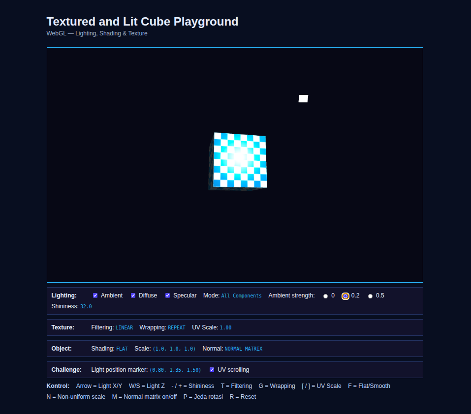

# Textured and Lit Cube Playground

Praktikum Grafika Komputer Pertemuan 5: WebGL2 dengan texture, lighting (ambient, diffuse, specular), dan kontrol interaktif.

## Identitas

- Kelompok: `Tim Unrendered` — Kelas `Grafika Komputer (B)`
- Anggota:
  - `Randi Palguna Artayasa` — `5025231020`
  - `Hikmia Sofia Nur Izzati` — `5025231147`

## Cara menjalankan

Jalankan `http-server` di folder project, lalu buka `http://localhost:8080`. Halaman tidak bisa dibuka langsung dari file (`file://`) karena `main.js` adalah ES module.

## Kontrol

| Kontrol | Fungsi |
| --- | --- |
| Arrow ← → / ↑ ↓ | Geser light di sumbu X / Y |
| W / S | Geser light di sumbu Z |
| Checkbox Ambient / Diffuse / Specular | Mode perbandingan lighting |
| Radio Ambient strength | Ambient 0 / 0.2 / 0.5 |
| - / + | Shininess (2 sampai 128) |
| T | Filtering LINEAR ↔ NEAREST |
| G | Wrapping REPEAT → CLAMP_TO_EDGE → MIRRORED_REPEAT |
| [ / ] | UV scale (0.25 sampai 5) |
| F | Flat ↔ smooth shading |
| N | Non-uniform scale (scaleY 1 ↔ 2) |
| M | Normal matrix ↔ model 3×3 (pembanding) |
| P | Jeda rotasi |
| R | Reset |
| Checkbox UV scrolling | Challenge UV scrolling |

Mode perbandingan: Ambient Only, Diffuse Only, Specular Only, Ambient + Diffuse, dan All Components didapat dari kombinasi centang. Nama mode tampil di panel Lighting.

## Texture dan parameter lighting

| Parameter | Nilai |
| --- | --- |
| Texture | Checkerboard 64×64 (8×8 kotak putih dan biru), dibuat dari canvas lalu di-sampling di fragment shader |
| Filtering / wrapping awal | LINEAR / REPEAT |
| Light | Posisi (1.5, 1.5, 1.5), warna putih |
| Kamera | (0, 1.4, 4), melihat ke (0, 0, 0) |
| Ambient strength | 0.2 |
| Shininess | 32 |

Specular memakai posisi kamera (`u_cameraPosition`), dan normal diubah dengan normal matrix.

## Hasil eksperimen

| Eksperimen | Nilai / Mode | Pengamatan |
| --- | --- | --- |
| Ambient | 0 · 0.2 · 0.5 | 0: sisi yang membelakangi light hitam pekat. 0.2: sisi itu redup tetapi pola masih terlihat. 0.5: semua sisi terang, kesan 3D berkurang |
| Shininess | 4 · 32 · 128 | 4: kilau sangat lebar. 32: bercak sedang. 128: titik kecil dan tajam |
| Filtering | NEAREST · LINEAR | Paling jelas di UV scale 0.25: NEAREST tepi kotak tajam, LINEAR kabur. Di UV scale 5, NEAREST tampak berkedip (moiré) |
| Wrapping | Repeat · Clamp · Mirror | Terlihat saat UV scale > 1. Repeat berulang rapi, Clamp satu pola lalu garis memanjang dari tepi, Mirror pola dicerminkan di setiap jahitan |
| Lighting | Ambient · Diffuse · Specular · All | Ambient: semua sisi sama redup dan tampak datar. Diffuse: sisi yang menghadap light terang, sisi lain hitam. Specular: hanya kilau putih, muncul saat sisi melewati sudut pantul yang pas. All: gabungan ketiganya |

## Challenge

1. **Light position marker**: kubus putih kecil digambar di posisi light tanpa lighting (`u_unlit`). Koordinatnya tampil di panel Challenge.
2. **UV scrolling**: saat dicentang, UV digeser 0.2 per detik ke arah horizontal (`u_uvOffset`), sehingga texture meluncur di permukaan kubus.

## Kendala

- Membuka `index.html` langsung dari file membuat module diblokir CORS. Solusinya menjalankan `http-server`.
- Perbedaan mode wrapping tidak terlihat saat UV scale 1, karena UV tidak keluar dari rentang 0–1. Solusinya menaikkan UV scale dengan `]`.
- Setelah elemen HUD Light dihapus dari HTML, `setHUD("lightInfo", ...)` menghasilkan error `null` dan render loop berhenti. Solusinya menghapus baris tersebut dari `updateHUD()`.
- Pada mode Specular Only kubus sering tampak hitam. Ini wajar karena kilau hanya muncul saat pantulan mengarah ke kamera.
