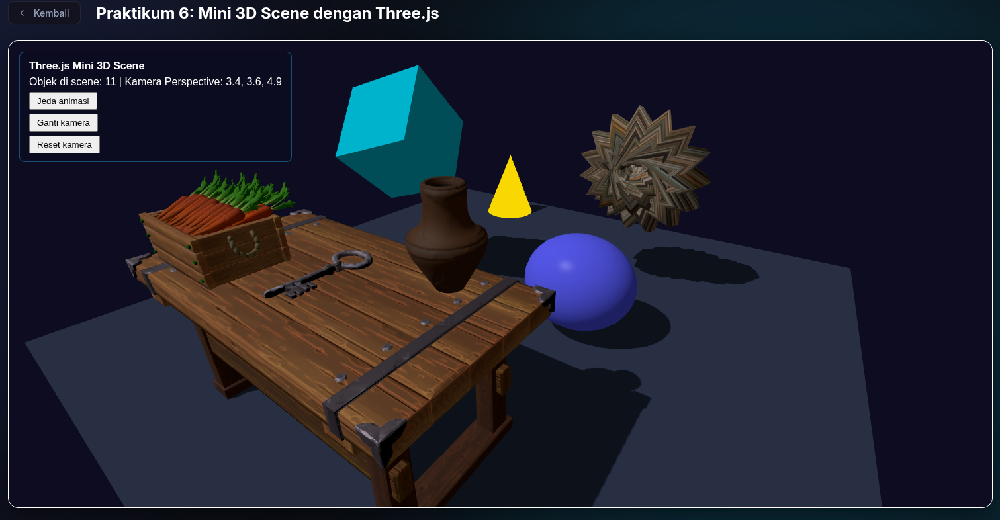

# Three.js Mini 3D Scene

Praktikum Grafika Komputer Pertemuan 6: membangun scene 3D kecil dengan Three.js, berisi geometry bawaan, model glTF, beberapa jenis material, lighting, shadow, dan animasi.

## Identitas

- Kelompok: `Tim Unrendered` — Kelas `Grafika Komputer (B)`
- Anggota:
  - `Randi Palguna Artayasa` — `5025231020`
  - `Hikmia Sofia Nur Izzati` — `5025231147`



## Deskripsi scene

Sebuah meja kerja (workbench) berdiri di atas lantai gelap. Di atas meja ada kunci logam, vas, dan peti wortel yang dimuat dari file glTF. Di sekitar meja ada kubus yang berputar sambil membesar-mengecil, bola yang naik-turun, torus knot bertekstur batu, dan kerucut kuning. Sebuah directional light berputar mengelilingi scene, sehingga bayangan objek di lantai ikut bergerak.

## Cara menjalankan

Project ini tidak memakai bundler dan tidak perlu `npm install`. Three.js versi 0.186.1 diambil dari CDN jsDelivr lewat import map di `index.html`, jadi cukup jalankan static server di folder project:

```bash
python3 -m http.server 8000
```

Lalu buka `http://localhost:8000`. Halaman tidak bisa dibuka langsung dari file (`file://`) karena `main.js` adalah ES module dan model glTF dimuat lewat `fetch`. Versi online bisa dibuka di GitHub Pages tanpa langkah build.

Struktur project:

```
├── index.html          # import map CDN Three.js
├── favicon.svg
├── models/glTF/        # model glTF beserta texture-nya
├── textures/           # batu.png untuk torus knot
└── src/
    ├── main.js
    └── style.css
```

## Kontrol

Tidak ada kontrol keyboard. Semua interaksi memakai mouse dan tombol di HUD.

| Kontrol | Fungsi |
| --- | --- |
| Drag kiri | Orbit kamera (OrbitControls) |
| Drag kanan | Pan kamera |
| Scroll | Zoom |
| Tombol Jeda animasi | Menjeda / melanjutkan semua animasi |
| Tombol Ganti kamera | Perspective ↔ Orthographic |
| Tombol Reset kamera | Kembali ke kamera perspective di posisi awal (4, 3, 6) |

## Geometry, material, dan light

### Objek

| Objek | Geometry | Material | Posisi |
| --- | --- | --- | --- |
| Kubus | `BoxGeometry(1, 1, 1)` | `MeshLambertMaterial`, cyan `0x22d3ee` | (-2, 2.5, 0) |
| Bola | `SphereGeometry(0.7, 32, 16)` | `MeshPhongMaterial`, biru `0x4488ff`, shininess 200 | (1.4, 0.9, 0) |
| Lantai | `PlaneGeometry(10, 10)`, diputar -90° di sumbu X | `MeshLambertMaterial`, abu-abu `0x334155` | (0, 0, 0) |
| Torus knot | `TorusKnotGeometry(0.5, 0.4, 64, 8, 20, 10)` | `MeshStandardMaterial` dengan texture `textures/batu.png` | (1.4, 2, -2) |
| Kerucut | `ConeGeometry(0.6, 1.5, 32)` | `MeshBasicMaterial`, kuning `0xfacc15` | (-2.5, 0.75, -4) |

### Model glTF

Dimuat dengan `GLTFLoader` dari folder `models/glTF/`. Materialnya dibaca dari file glTF (PBR, dengan texture base color, normal, dan ORM).

| Model | Posisi | Skala |
| --- | --- | --- |
| `Workbench.gltf` | (0, 0, 3) | 2 |
| `Key_Metal.gltf` | (0, 1.82, 3) | 10 |
| `Vase_4.gltf` | (1.2, 1.82, 2.5) | 2 |
| `FarmCrate_Carrot.gltf` | (-1.2, 1.82, 3.4) | 2 |

### Light

| Light | Parameter |
| --- | --- |
| `AmbientLight` | Putih, intensitas 0.35 |
| `DirectionalLight` | Putih, intensitas 2, posisi awal (3, 5, 2), `castShadow = true` |

## Konfigurasi shadow

| Pengaturan | Nilai |
| --- | --- |
| Renderer | `renderer.shadowMap.enabled = true` |
| Shadow map size | 1024 × 1024 |
| Shadow camera (orthographic) | left -5, right 5, top 5, bottom -5, near -5, far 10 |
| Cast shadow | Kubus, bola, torus knot, kerucut, semua mesh di model glTF |
| Receive shadow | Lantai, kerucut |

Batas shadow camera ±5 dipilih agar sama dengan ukuran lantai 10 × 10, sehingga seluruh lantai bisa menerima bayangan tanpa membuang resolusi shadow map.

## Animasi

Semua animasi memakai `delta` dari `THREE.Timer` (dibatasi maksimal 0.05 detik) supaya kecepatannya tidak bergantung pada frame rate.

| Objek | Animasi |
| --- | --- |
| Kubus | Rotasi X 0.35 rad/s dan Y 0.8 rad/s, skala seragam berosilasi 1–3 (`2 + sin(2t)`) |
| Bola | Naik-turun 0.15 di sekitar y = 0.9, skala X berosilasi 1–2 |
| Directional light | Berputar di lingkaran radius 4 pada bidang XZ dengan kecepatan 0.5 rad/s |

## Challenge

1. **Tambah 2 geometry**: `TorusKnotGeometry` (diberi texture batu dengan `TextureLoader`, color space sRGB) dan `ConeGeometry`.
2. **Material gallery**: empat jenis material dipakai berdampingan. `MeshBasicMaterial` pada kerucut tidak terpengaruh cahaya sehingga warnanya rata. `MeshLambertMaterial` pada kubus dan lantai hanya punya diffuse, tanpa kilau. `MeshPhongMaterial` pada bola memberi highlight specular yang tajam (shininess 200). `MeshStandardMaterial` pada torus knot memakai model PBR dengan texture.
3. **OrthographicCamera**: tombol Ganti kamera beralih antara `PerspectiveCamera` (FOV 60) dan `OrthographicCamera` dengan tinggi view 8 unit. Posisi kamera dan target OrbitControls disalin saat berganti, lalu OrbitControls dibuat ulang untuk kamera baru. Frustum orthographic ikut disesuaikan dengan aspect ratio saat jendela di-resize.
4. **Light animation**: posisi directional light diubah setiap frame dengan `sin` dan `cos`, sehingga arah bayangan di lantai berputar.
5. **Shadow quality**: shadow map 1024 × 1024 dan batas shadow camera disesuaikan dengan ukuran lantai (lihat bagian Konfigurasi shadow).
6. **Scene information**: HUD menampilkan jumlah objek di scene (`scene.children.length`), jenis kamera aktif, dan posisi kamera, diperbarui setiap frame.
7. **Toggle animation**: tombol Jeda animasi membuat `delta` bernilai 0, sehingga rotasi, osilasi, dan gerakan light berhenti. Label tombol berganti menjadi "Lanjutkan Animasi". OrbitControls tetap bisa dipakai saat animasi dijeda.

## Catatan debugging

- Project awalnya dibuat dengan Vite. GitHub Pages hanya menyajikan file statis, sehingga `import "three"` dan `import "./style.css"` yang biasanya diproses Vite tidak bisa di-resolve browser. Solusinya menambahkan import map ke CDN jsDelivr dan memuat CSS lewat `<link rel="stylesheet">`, lalu file Vite (`package.json`, `node_modules/`, dan lainnya) dihapus.
- Di GitHub Pages situs berada di subfolder repo, bukan di root domain. Path absolut seperti `/src/main.js`, `/textures/batu.png`, dan `/models/glTF/` jadi mengarah ke root domain dan gagal dimuat (404). Semua path diubah menjadi relatif (`./`), dan isi folder `public/` dipindah ke root project.
- Import `GLTFLoader` dari `three/examples/jsm/Addons.js` ikut memuat semua addon Three.js. Import diganti langsung ke `three/addons/loaders/GLTFLoader.js`.
- Kerucut diberi `receiveShadow = true`, tetapi bayangan tidak pernah tampak di permukaannya. Ini wajar karena `MeshBasicMaterial` tidak menghitung cahaya sama sekali, termasuk bayangan.
- Jumlah objek di HUD awalnya 7 lalu naik menjadi 11. `GLTFLoader` memuat model secara asinkron, jadi keempat model baru masuk ke scene setelah file selesai diunduh. Angka ini juga ikut menghitung ambient light dan directional light.
